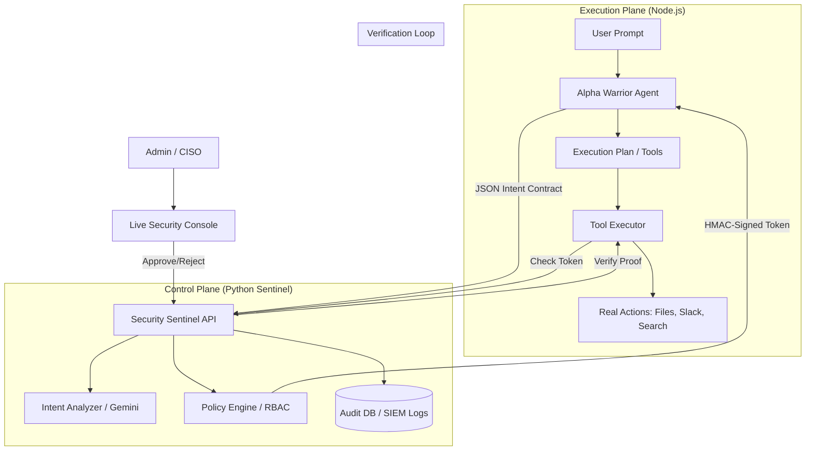

# 🏗️ Alpha Warrior: Architecture Diagram

This diagram illustrates the **Control Plane vs Execution Plane** separation, which is the core of our "Intent-First" security model.

## Key Architectural Principles:
1. **Isolated Reasoning**: The LLM never sees the security keys or the policy database.
2. **Cryptographic Bonding**: Any change to the agent's plan mid-run invalidates the HAMC signature.
3. **Fail-Closed**: If the Sentinel backend is offline, the Agent enters a hard-lock state.
